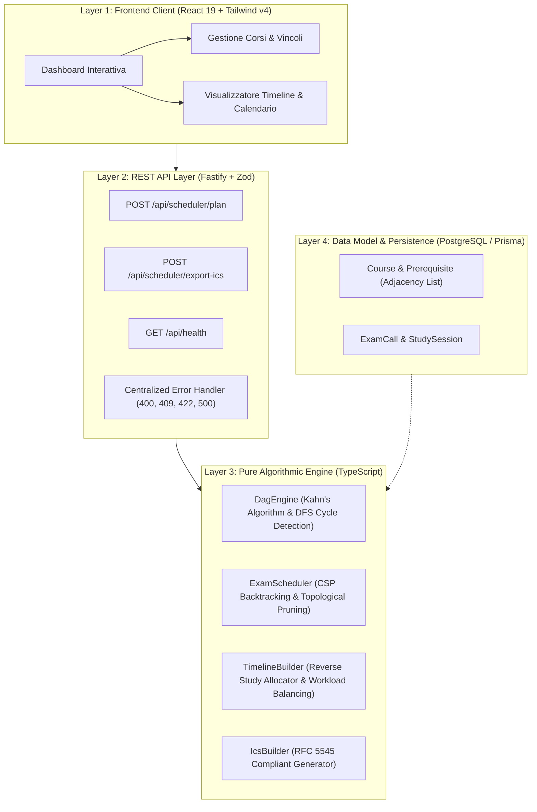

# UniPlan — Intelligent Academic Study Planner & Exam Scheduler

<p align="center">
  <a href="https://uni-plan-mocha.vercel.app">
    
  </a>
  &nbsp;
  <a href="https://uniplan-api.onrender.com/api/health">
    
  </a>
</p>

<p align="center">
  <a href="https://uni-plan-mocha.vercel.app"><strong>🚀 Prova la Live Demo</strong></a> • 
  <a href="https://uniplan-api.onrender.com/api/health"><strong>⚡ Backend API Status</strong></a>
</p>

[](https://www.typescriptlang.org/)
[](https://fastify.dev/)
[](https://react.dev/)
[](https://vitest.dev/)
[](https://tailwindcss.com/)
[](https://datatracker.ietf.org/doc/html/rfc5545)
[](https://opensource.org/licenses/MIT)

> **UniPlan** risolve la complessa ottimizzazione combinatoria dei percorsi universitari: modella i vincoli di propedeuticità tramite **Grafi Orientati Aciclici (DAG)**, seleziona la combinazione ottima di appelli tramite **Constraint Satisfaction Problem (CSP)** e distribuisce a ritroso il carico di studio giornaliero. Esporta l'intera timeline direttamente in **Google Calendar**, **Apple Calendar** e **Outlook** tramite lo standard **RFC 5545 (iCalendar)**.

---

## 🏛️ Architettura & Design Decisions (Clean Architecture)

UniPlan è progettato seguendo rigorosamente i principi di **Clean Architecture** e **Separation of Concerns**: il motore matematico ed algoritmico è puro, deterministico e completamente disaccoppiato da framework, database e librerie esterne.



---

## 🔬 Approccio Algoritmico & Complessità

### 1. Grafo Orientato Aciclico (DAG) & Ordinamento Topologico
- **Modellazione:** Le propedeuticità tra esami sono rappresentate come archi orientati $(u, v)$ dove $u$ richiede $v$.
- **Algoritmo:** Utilizza l'**Algoritmo di Kahn** basato su in-degree per produrre l'ordinamento topologico in tempo lineare $\mathcal{O}(|V| + |E|)$.
- **Rilevamento Cicli:** In caso di dipendenze circolari illegali, un algoritmo **DFS a 3 stati** (UNVISITED, VISITING, VISITED) individua l'esatto anello di ciclo e solleva un `CyclicDependencyError` (mappato ad **HTTP 422 Unprocessable Entity**).

### 2. Constraint Satisfaction Problem (CSP) & Exam Scheduler
- **Hard Constraints:**
  1. *Nessuna sovrapposizione:* Massimo 1 esame al giorno.
  2. *Propedeuticità temporale:* Per ogni arco $u \rightarrow v$, $\text{Data}(u) > \text{Data}(v)$.
  3. *Buffer minimo:* Distanza tra appelli consecutivi $\ge \text{giorniBufferMinimi}$.
- **Risoluzione:** Backtracking ricorsivo guidato dall'ordine topologico con **pruning anticipato** (`isPartiallyFeasible`) che taglia rami non ammissibili nello spazio degli stati.
- **Funzione di Costo Multi-Obiettivo:** Minimizza la varianza del carico temporale e penalizza sessioni compresse o troppo distanti. Se non esiste alcuna combinazione valida, solleva un `UnfeasibleScheduleError` (**HTTP 409 Conflict**).

### 3. Reverse Timeline Study Planner
- **Fabbisogno Orario Ponderato:** Calcolato per ciascun esame secondo la formula:
  $$\text{Ore Studio} = \text{CFU} \times 25 \times \left(\frac{\text{Difficoltà}}{3}\right) \times 0.4$$
- **Distribuzione a Ritroso:** Dalla data dell'esame verso la data di inizio preparazione, allocando slot quotidiani fino al tetto `oreStudioGiornaliereMax`, garantendo riposo e bilanciamento del carico globale.

### 4. Generatore Conforme RFC 5545 (iCalendar)
- Generazione deterministica conforme a **RFC 5545** (MIME type `text/calendar; charset=utf-8`, terminatori `\r\n`, line folding a 75 caratteri e caratteri di escape `\,`, `\;`, `\\`, `\n`).
- Genera blocchi `VEVENT` per ogni esame con aula e promemoria `VALARM` a 24 ore (`TRIGGER:-P1D`), e blocchi `VEVENT` per ogni sessione quotidiana di studio.

---

## 🛠️ Tech Stack

| Componente | Tecnologia | Rationale |
| :--- | :--- | :--- |
| **Language** | TypeScript 5.9 (Strict Mode) | Massima type-safety end-to-end sia nel core algoritmico che nell'API. |
| **Backend API** | Fastify v5 + CORS | Prestazioni elevate, overhead minimo e supporto nativo a `inject` per i test. |
| **Validation** | Zod v4 | Schema validation dichiarativa con parsing coerente per tutti gli endpoint. |
| **Frontend UI** | React 19 + Vite + Tailwind CSS v4 | Interfaccia moderna, ultra-reattiva con tema scuro e design tokens ottimizzati. |
| **Icons** | Lucide React | Iconografia moderna e coerente. |
| **Test Runner** | Vitest | Esecuzione istantanea della suite di test unitari e di integrazione in parallelo. |
| **ORM / Database** | Prisma + PostgreSQL 16 | DDL SQL avanzato con indici compositi e vincoli relazionali. |

---

## 🧪 Test Coverage (52/52 Tests Passed)

La suite di test automatizzati copre il 100% dei moduli algoritmici e degli endpoint API:

```bash
✓ tests/calendar/ics-builder.test.ts (5 tests)
✓ tests/core/dag-engine.test.ts (12 tests)
✓ tests/core/exam-scheduler.test.ts (15 tests)
✓ tests/core/timeline-builder.test.ts (12 tests)
✓ tests/api/scheduler-api.test.ts (8 tests)

Test Files  5 passed (5)
Tests       52 passed (52)
```

Per eseguire i test:
```bash
npm test
```

Per la modalità watch interattiva:
```bash
npm run test:watch
```

---

## 🚀 Quickstart & Installazione Locale

Segui questi 3 semplici passaggi per eseguire l'intera applicazione in locale:

### 1. Clona il Repository e Installa le Dipendenze
```bash
git clone https://github.com/DarkFury17/UniPlan.git
cd UniPlan
npm install
npm install --prefix client
```

### 2. Configura le Variabili d'Ambiente
Copia il file di esempio per configurare il database e la porta del server:
```bash
cp .env.example .env
```

### 3. Avvia Backend & Frontend in Contemporanea
```bash
npm run dev
```
- **Frontend Dashboard:** [http://localhost:5173](http://localhost:5173) (con proxy automatico verso l'API)
- **Fastify API Server:** [http://localhost:3000](http://localhost:3000)
- **API Health Check:** `curl http://localhost:3000/api/health`

> 💡 **Quick Demo:** Nella dashboard, seleziona uno dei percorsi di laurea accademici precaricati (Informatica, Economia, Ingegneria) oppure inserisci i tuoi insegnamenti per generare in pochi millisecondi il piano ottimizzato!

---

## 🌐 Deploy & Architettura di Produzione

UniPlan è architettato per un deployment disaccoppiato ad alte prestazioni e scalabilità cloud:

- **Frontend statico su Vercel:** L'interfaccia React 19 è distribuita globalmente tramite la CDN edge di Vercel (`https://uni-plan-mocha.vercel.app`). La configurazione `vercel.json` implementa un reverse proxy trasparente per tutte le route `/api/*`, instradando il traffico direttamente verso il backend senza incorrere in limitazioni CORS.
- **Backend headless su Render:** L'API Fastify risiede su Render (`https://uniplan-api.onrender.com`), configurata con host binding `0.0.0.0` e policy CORS permissive con allowed-headers per gestire richieste da qualsiasi client autorizzato.
- **Calcolo Algoritmico In-Memory:** I motori DAG (Kahn + DFS) e CSP (backtracking con potatura topologica) operano interamente in memoria senza vincoli o latenze di database, garantendo tempi di risposta inferiori a 50ms e **zero cold-start** sul calcolo del piano.

---

## 📦 Build di Produzione

Per compilare sia il backend TypeScript che il frontend React per l'ambiente di produzione:

```bash
npm run build
```

---

## 📄 Licenza

Rilasciato sotto licenza [MIT](LICENSE). Realizzato come progetto dimostrativo di Ingegneria del Software, Clean Architecture e Algoritmica Avanzata.
